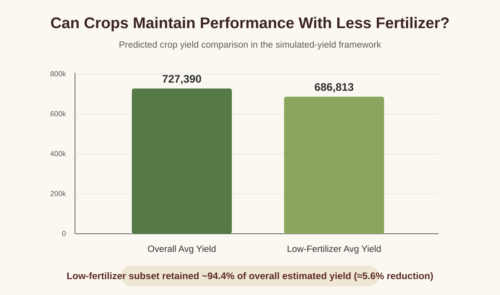
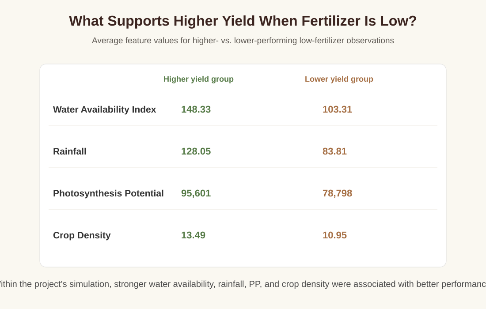

# Smart Farming Crop Yield Analysis

An applied data science project exploring whether crops can maintain competitive estimated yields under reduced fertilizer usage and which environmental conditions are associated with stronger performance.

## Project Overview

This project was completed as part of **Big Data Analytics Methods (STA 4724)** at the University of Central Florida. The broader team project examined sustainable agriculture using a Smart Farming dataset containing soil, climate, crop, resource-use, and environmental variables.

My work focused on building the analytical foundation for the project and answering:

> **Can crops maintain performance with less fertilizer, and what variables allow crops to perform well when fertilizer usage is low?**

## My Contributions

I was responsible for:

- Conducting the exploratory data analysis (EDA) of the dataset
- Writing the project introduction and framing the sustainability problem
- Researching how to construct meaningful derived agricultural variables from the available data
- Engineering multiple features to make the dataset more analytically useful
- Creating a simulated crop-yield target because crop yield was not directly provided in the source dataset
- Log-transforming the crop-yield estimate to reduce skewness
- Building and tuning a **Decision Tree Regressor**
- Analyzing predicted crop performance under low fertilizer usage
- Comparing conditions associated with higher vs. lower performance under reduced fertilizer
- Developing and presenting the fertilizer/yield findings shown in the project presentation

## Feature Engineering

Because the source dataset did not contain a direct crop-yield target, I created several derived variables to represent agronomic conditions:

| Feature | Purpose |
| --- | --- |
| **THI** | Temperature-Humidity Index combining temperature and humidity |
| **NBR** | Nutrient Balance Ratio based on nitrogen, phosphorus, and potassium |
| **WAI** | Water Availability Index combining soil moisture and rainfall |
| **PP** | Photosynthesis Potential using sunlight exposure, CO₂ concentration, and temperature |
| **SFI** | Soil Fertility Index combining organic matter and NPK levels |
| **Estimated Average Yield per Plant** | Simulated plant productivity using fertilizer, fertility, photosynthesis, water, growth stage, pest pressure, and frost risk |
| **Crop Yield** | Estimated yield based on crop density and estimated yield per plant |

The estimated crop yield was subsequently transformed using `log1p` because the original simulated target was strongly right-skewed.

> **Important:** Crop yield in this project is an engineered/simulated target derived from the available dataset rather than an observed real-world yield measurement. Results should therefore be interpreted as analysis of the project's simulation, not as causal agronomic evidence.

## Modeling

I trained a **Decision Tree Regressor** to predict log crop yield using:

- Fertilizer usage
- Water Availability Index (WAI)
- Rainfall
- Photosynthesis Potential (PP)
- Temperature-Humidity Index (THI)
- Pest pressure
- Frost risk
- Growth stage
- Crop density

The data was split **70/30** into training and test sets. Hyperparameters were selected using **5-fold GridSearchCV** over tree depth and minimum leaf size.

### Model Results

The original project results were:

- **Best max depth:** 10
- **Best minimum samples per leaf:** 6
- **Test MSE:** ~0.228
- **Test R²:** ~0.754

## Can Crops Maintain Performance With Less Fertilizer?

I defined **low fertilizer usage** as observations at or below the dataset's 25th percentile for fertilizer usage and used the trained model to estimate yield for that subset.

The original analysis produced:

- Overall estimated average yield: approximately **727,390**
- Low-fertilizer estimated average yield: approximately **686,813**
- Difference: approximately **40,577**
- Estimated reduction: approximately **5.6%**
- Estimated yield retained under low fertilizer: approximately **94.4%**

Within this simulated framework, the low-fertilizer subset retained most of the estimated yield of the overall sample.



## What Conditions Were Associated With Better Performance Under Low Fertilizer?

I split the low-fertilizer observations into higher- and lower-performing groups and compared their average environmental/model features.

The analysis highlighted several notable differences:

- **Water Availability Index:** 148.33 vs. 103.31
- **Rainfall:** 128.05 vs. 83.31
- **Photosynthesis Potential:** 95,601 vs. 78,798
- **Crop density:** 13.49 vs. 10.95

Within the project's simulated yield framework, stronger water availability, rainfall, photosynthesis potential, and crop density were associated with higher predicted performance when fertilizer usage was low.



## Project Files

### Python Analysis

The original Jupyter Notebook contains the Python analysis used for the project, including exploratory analysis, feature engineering, crop-yield construction, decision-tree modeling, tuning, and investigation of the two research questions.

**[View the Jupyter Notebook](src/smart_farming_crop_yield_analysis.ipynb)**

### Project Presentation

The team presentation summarizes the broader project and includes the fertilizer/yield findings I developed and presented.

**[View the Project Presentation](assets/smart_farming_project_presentation.pdf)**

See `data/README.md` for dataset setup information.

## Tools & Methods

**Python · Pandas · NumPy · Matplotlib · Scikit-learn · Decision Tree Regression · GridSearchCV · Feature Engineering · EDA · Regression**

## Repository Structure

```text
Smart-Farming-Crop-Yield-Analysis/
├── README.md
├── requirements.txt
├── .gitignore
├── assets/
│   ├── crop-yield-comparison.svg
│   ├── low-fertilizer-conditions.svg
│   └── smart_farming_project_presentation.pdf
├── data/
│   └── README.md
└── src/
    └── smart_farming_crop_yield_analysis.ipynb
```

## Team Project Context

This repository highlights **my individual analytical contribution** within a larger academic team project. Other team members investigated separate research questions using methods including Random Forest, Lasso regression, and water-efficiency modeling.

The full team report is available in my coursework repository:

https://github.com/matteodagostino/Big-Data-Analytics-Methods/blob/main/reports/final-report.pdf

## Key Takeaway

This project taught me how to move from an imperfect real-world-style dataset to a structured analytical question: research the domain, engineer meaningful features, construct a usable target, build and evaluate a model, and translate the results into a practical decision-oriented finding.
